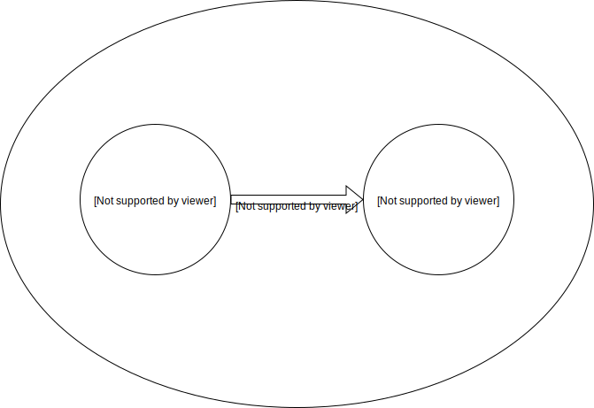

# Basic Concepts

## Market Basket Analysis

2. market basket analysis: what kind of items are placed in the basket together
3. association rules: computer ⇒ antivirus software [support = 2%, confidence = 60%]
4. support: 2% of all the transcations showed that computer and antivirus software are purchased together
5. confidence: 60% of all customers who purchased computer also purchased antivirus software

## Frequent Itemsets, Closed Itemsets, and Association Rules

1. Support(A->B) = P( A and B )
2. Confidence(A->B) = P( B | A )

1. itemset
2. k-itemset
3. occurrence frequency of an itemset

1. closed
2. closed frequent itemset
3. maximal frequent itemset/max-itemset